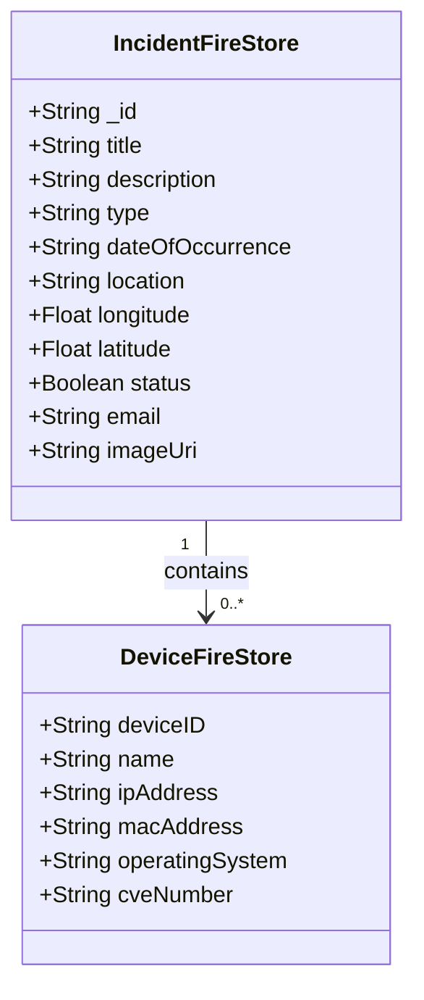
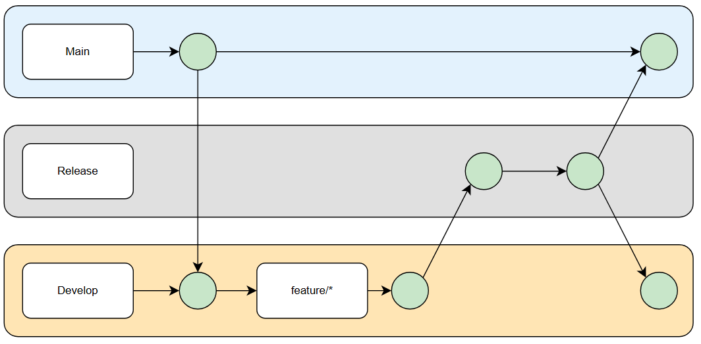

# Technical Report: Cybersecurity Incident Tracker

## 1. Project Overview

The **Cybersecurity Incident Tracker** is an Android application designed to log, manage, and analyze security incidents and their associated devices.

---

## 2. Functionality and APIs Used

### Core Features:
- User registration, login, and authentication
- Adding, viewing, editing, and deleting cybersecurity incidents
- Device management for each incident
- Swipe-to-edit/delete gesture support
- Search/filter/sorting functionality
- Dark Mode
- using third party API to return CVE details
- list All Incidents

### Third-Party / Google APIs:
- **Firebase Authentication**: Used for secure user sign-in and account management.
  - **Google Auth**: Enabled users to sign in with thier google accounts.
- **Firebase Firestore**: For NoSQL data storage.
- **Firebase Storage** : To store user profile images.
- **Coil**: image loading and caching library for Compose.
- **CVE API**: Used with retrofit to return details about a devices CVE number (e.g., BASE_URL + {cve_id})

---

## 3. UML & Class Diagrams

> 

---

## 4. UX / DX Approach Adopted

**Approach Chosen**: Jetpack Compose-first design

### Rationale:

---

## 5. Git & Version Control

### Git Workflow

For this project, I followed a Git workflow involving `develop`, `release`, and `main` branches to manage feature development, testing, and production deployment.

- **Development Work**:  
  All feature development was done on the `develop` branch.

- **Feature Branches**:  
  For each new feature, I created a branch using the format:`feature/google-auth`

- **Merging Features**:  
  Once a feature was complete, I merged the `feature/<feature-name>` branch back into `develop`.

- **Release Preparation**:  
  When a group of features was ready, I merged `develop` into the `release` branch. I tested edge cases and fixed bugs.

- **Deployment**:  
  After fixing any issues in the `release` branch, I merged `release` into `main`, and then created a new release.

This workflow ensured separation between development, staging, and production.

**Repository Link**:  
[GitHub - Cybersecurity Incident Tracker](https://github.com/JRDNVI/Cybersecurity-Incident-tracker)

---

## 6. Personal Statement

---

## 7. References
https://developer.android.com/reference/kotlin/androidx/compose/material/DismissState
https://developer.android.com/reference/kotlin/androidx/compose/material/DismissDirection
https://www.geeksforgeeks.org/android-jetpack-compose-swipe-to-dismiss-with-material-3/
https://mujeebkhan1831.medium.com/how-to-implement-dark-and-light-theme-in-jetpack-compose-f96e4cef3017
https://m3.material.io/components/switch/overview
---

