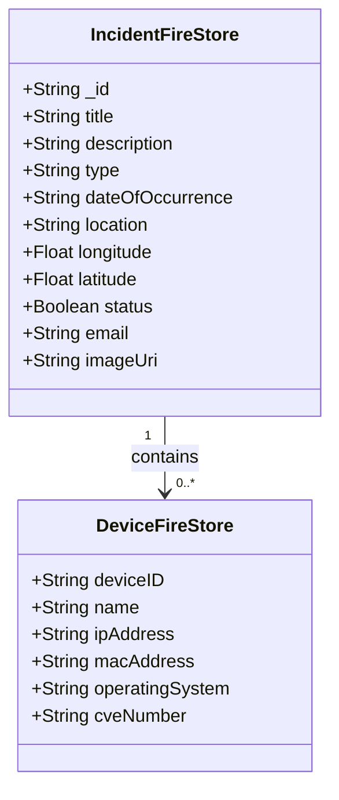

# Technical Report: Cybersecurity Incident Tracker

## 1. Project Overview

The **Cybersecurity Incident Tracker** is an Android application designed to log, manage, and analyze security incidents and their associated devices.

---

## 2. Functionality and APIs Used

### Core Features:
- User registration, login, and authentication
- Adding, viewing, editing, and deleting incidents 
- Device management for each incident
- Swipe card to edit/delete
- Search/filter/sorting functionality
- Dark Mode
- using third party API to return CVE details for each device
- list All Incidents from every user
- Show the location of every incident on google maps
- Edit user profile picture 

### Third-Party / Google APIs:
- **Firebase Authentication**: Used for secure user sign-in and account management.
  - **Google Auth**: Enabled users to sign in with thier google accounts.
- **Firebase Firestore**: For NoSQL data storage.
- **Firebase Storage** : To store user profile images.
- **Coil**: image loading and caching library for Compose.
- **CVE API**: Used with retrofit to return details about a devices CVE number (e.g., BASE_URL + {cve_id})
- **Google Maps API** Used to get long/lat of user and to show google maps

---

## 3. UML & Class Diagrams

> 

---

## 4. UX / DX Approach Adopted

**Approach Chosen**: I only used compose. Compose provides many features that reduces development time and codebase size.
- Core Compose Functionality used:
  - remember, mutableStateOf, StateFlow, viewModel(): Allows UI to be state driven making it reactive.
  - @Composable functions: Makes building UIs easier by creating small components (e.g, Cards ) and reusing them throughout the app.
  - Material 3: Used OutlinedTextField, Button, Scaffold, TopAppBar, BottomBar, etc.
  - Navigation: Used NavHostController and NavigationDestination routing.
  - Testing: @Preview used for layout previews.

---

## 5. Git & Version Control

### Git Workflow

For this project, I followed a Git workflow involving `develop`, `release`, and `main` branches to manage feature development, testing, and production deployment.

- **Development Work**:  
  All feature development was done on the `develop` branch.

- **Feature Branches**:  
  For each new feature, I created a branch using the format:`feature/google-auth`

- **Merging Features**:  
  Once a feature was complete, I merged the `feature/<feature-name>` branch back into `develop`.

- **Release Preparation**:  
  When a group of features was ready, I merged `develop` into the `release` branch. I tested edge cases and fixed bugs.

- **Deployment**:  
  After fixing any issues in the `release` branch, I merged `release` into `main`, and then created a new release.

This workflow ensured separation between development, staging, and production.

**Repository Link**:  
[GitHub - Cybersecurity Incident Tracker](https://github.com/JRDNVI/Cybersecurity-Incident-tracker)
---

## 6. Personal Statement
This project was a great for reinforcing the core concepts of Android development and extending my understanding of how to interact 
and implement external APIs into my application (e.g., Firebase, Google Maps, CVE API). As I was developing compose became easier to
use, which made creating UIs, connecting routes, and managing states became very quick to do. This project also helped my understanding of
git (e.g., rebase, etc..). Adopting a develop and release branch strategy made version control more effeicent but also safer.

In summary, I really enjoyed making this application and feel comfortable with kotlin/compose/firebase.

---

## 7. References
- Swipe functionality for cards
  - https://developer.android.com/reference/kotlin/androidx/compose/material/DismissState
  - https://developer.android.com/reference/kotlin/androidx/compose/material/DismissDirection
  - https://www.geeksforgeeks.org/android-jetpack-compose-swipe-to-dismiss-with-material-3/

- Dark Mode & Switch 
  - https://mujeebkhan1831.medium.com/how-to-implement-dark-and-light-theme-in-jetpack-compose-f96e4cef3017
  - https://m3.material.io/components/switch/overview

- Used `ComposeExamples-toml` to help with Google maps integration.
- Postman used to understand the JSON object structure of the CVE API response.
---

